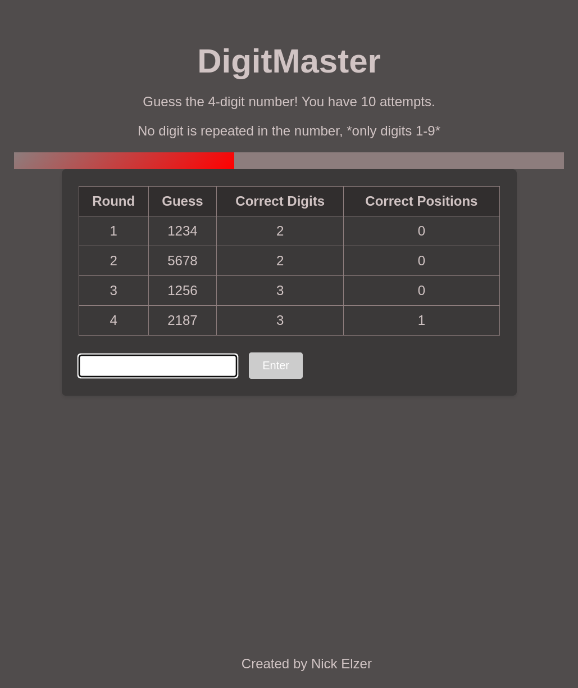

# DigitMaster

## Description

DigitMaster is a fun and engaging game designed to help users improve their mathematical skills. The game presents randomly generated 4-digit numbers, and players must solve figure them out as quickly and accurately as possible. The game is perfect for anyone looking to sharpen their mental math abilities and have a great time doing it.

The player has 10 attempts to guess the secret number. After each guess, the player is provided with feedback on the number of correct digits and the number of correct digits in the correct position. The game ends when either the player guesses the correct number or exhausts all 10 attempts.

To solve this puzzle, you can use a systematic approach to make your guesses.

click the link to play, or download for yourself!
https://nick-elzer.github.io/DigitMasterv1.0/

## Table of Contents

- [Installation](#installation)
- [Usage](#usage)
- [Rules](#rules)
- [Screenshot](#screenshot)
- [Credits](#credits)

## Installation

To install and run DigitMaster, follow these steps:

1. Clone the repository:
``` git clone https://github.com/nick-elzer/DigitMaster.git ```
2. Navigate to the project directory:
``` cd DigitMaster ```
4. Open 'DigitMaster.html', the game should open in your default web browser.

## Usage

 1. Select your level</h4>
 .....Easy: Highlights correct position green, correct digit yellow</h4>
 .....Medium: Highlights correct digit yellow</h4>
 .....Hard: No highlights</h4>
 2. Only digits 1-9 are used</h4>
 3. No digit is repeated in the generated number</h4>
 4. Players only have 10 guesses to complete the challenge</h4>
 5. The game will generate random numbers, ensuring a unique experience each time.</h4>
 6. There is a progress bar and counter to keep track of the attempts</h4>

## Rules

- only digits 1-9 are used
- No digit is repeated in the generated number
- Players only have 10 guesses to complete the challenge
- The game will generate random numbers, ensuring a unique experience each time.
- There is a progress bar and counter to keep track of the attempts

## Screenshot



## Credits

- [Nick Elzer](https://github.com/nick-elzer) - Creator and Developer
